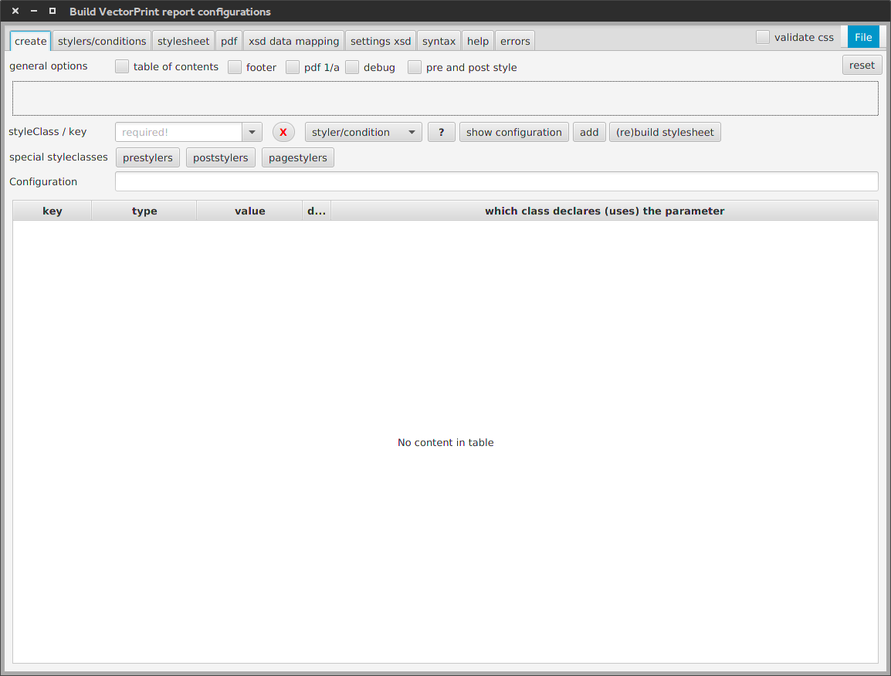
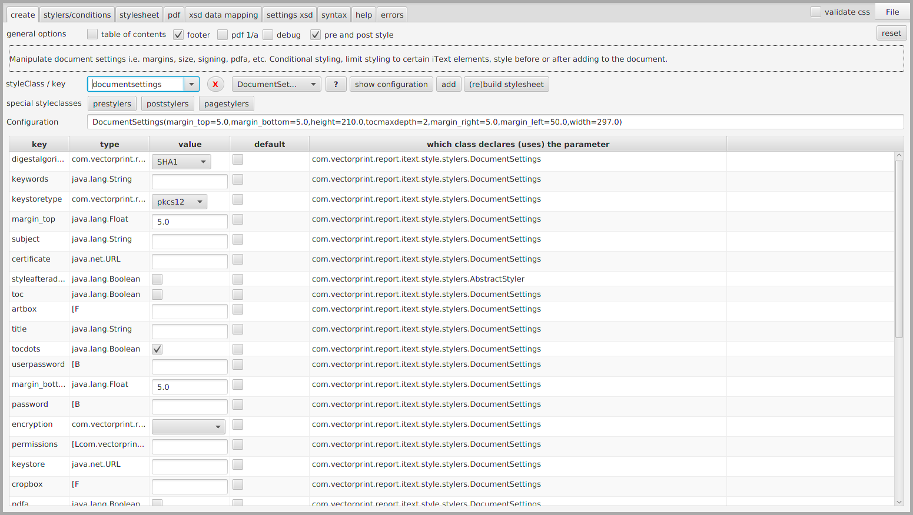
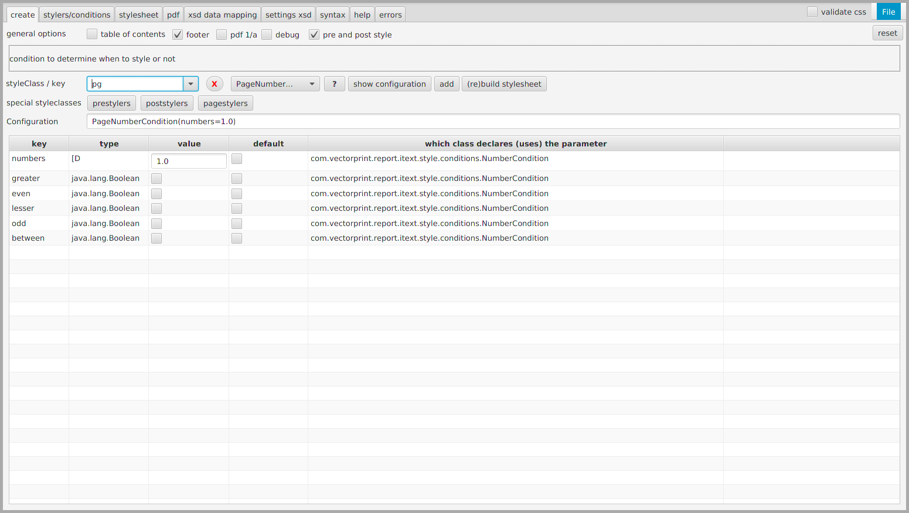
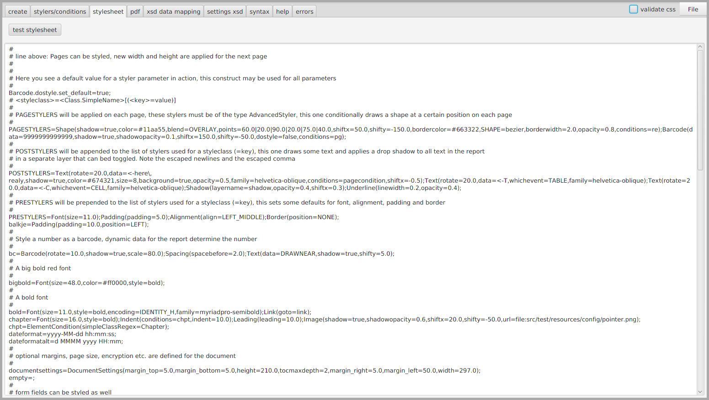
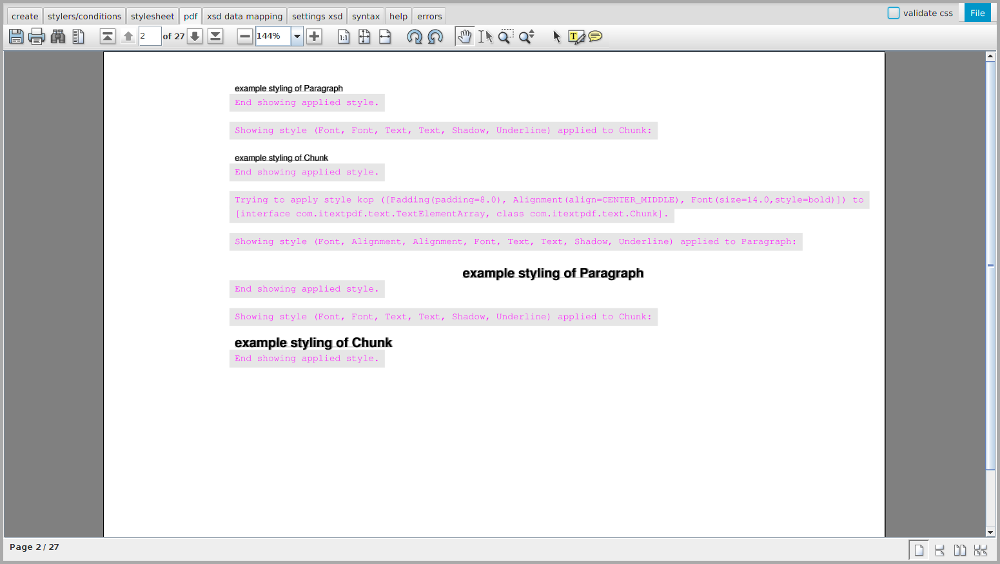
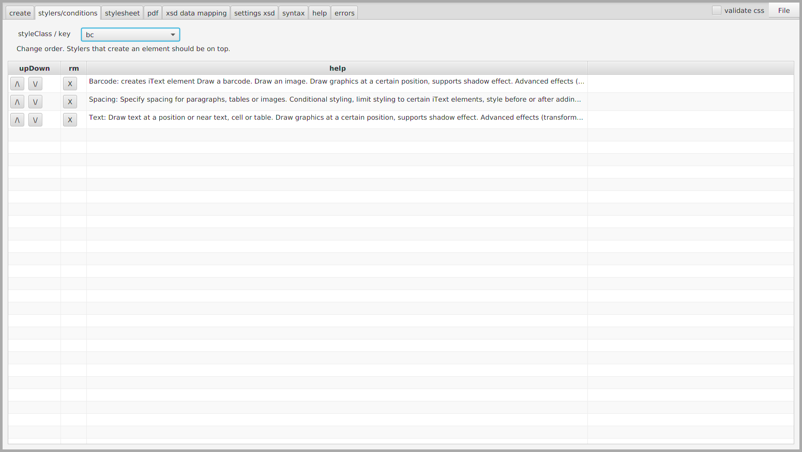
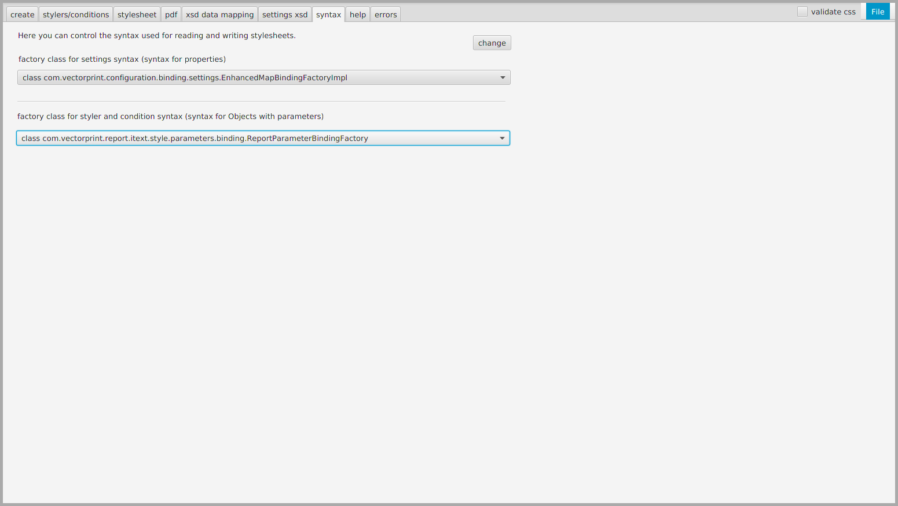

# iText-GUI
A JavaFX GUI supporting the ConfigurableReports library

This GUI lets you import, create, modify and test stylesheets for iText. The GUI should give you a pretty good idea of what ConfigurableReports can do for you. See https://github.com/eduarddrenth/ConfigurableReports.

With a stylesheet, datamapping and the implementation of 1 Java class you are able to generate iText reports almost without coding.

The GUI:

